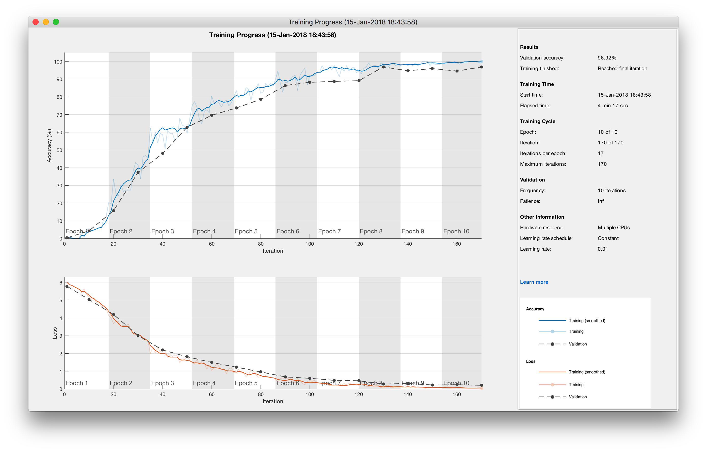

This website contains datasets of Channel State Information (CSI) traces for the following paper.

[Yongsen Ma](http://www.cs.wm.edu/~yma/), [Gang Zhou](http://gzhou.blogs.wm.edu), Shuangquan Wang, Hongyang Zhao, and Woosub Jung. **SignFi: Sign Language Recognition using WiFi. ACM IMWUT (UbiComp '18)**.


### Files
This repository contains the following files.

| Files | Description | Size |
| ----- | ----------- | ---- |
| [dataset_home_276.mat](https://wm1693.box.com/s/mmikgi9ubkg7vnwaztplnxudh8sgj1np) | Downlink and uplink CSI traces for 276 sign words in the home environment. There are 2,760 instances of 276 sign gestures performed by one user. | 1.37GB |
| [dataset_lab_276_dl.mat](https://wm1693.box.com/s/z9vsrn3998n4xyzkpqtj89yclk28eatp) | Downlink CSI traces for 276 sign words in the lab environment. There are 5,520 instances of 276 sign gestures performed by one user.| 1.44GB |
| [dataset_lab_276_ul.mat](https://wm1693.box.com/s/5hr4u7lsj10c329oibp8fjv95i524tnl) | Uplink CSI traces for 276 sign words in the lab environment. There are 5,520 instances of 276 sign gestures performed by one user.| 1.33GB |
| [dataset_lab_150.mat](https://wm1693.box.com/s/kidoq54rv93ysojgzv7xjqixyzwir7lq) | Downlink CSI traces for 150 sign words in the lab environment. There are 7,500 instances of 150 sign gestures performed by five users. | 1.93GB |
| [signfi_cnn_example.m](https://wm1693.box.com/s/pvlrxb7cxexgfquyt1dqn52a49kz90db) | MATLAB source code for training and testing using the dataset. | 3KB |
| [training_screen_shot.png](https://wm1693.box.com/s/4vkpfzet9cctpya8pcjorq646adomboe) | A screen shot of the training process | 541KB |
| [sign_labels.csv](https://wm1693.box.com/s/wu3bvgbuzbypfvsq716qqgynpw8qriiy) | Labels for 276 sign words used in the measurement. | 2KB |
| [videos/](https://wm1693.box.com/s/ptdahj91p3uaxm49fz24b398xxzu7yl7) | This folder contains the videos for 276 basic sign words. These videos are used for the participant to learn and perform sign gestures during data collection. | 105.9MB |
| [README.md](https://wm1693.box.com/s/jx4t4aeg5gm3xhnh8v5ooj7cr6qb3xgv) | Readme | 5KB |

Both downlink and uplink CSI traces are included for the 276 sign words in the lab and home environments. Only downlink CSI traces are used in the paper. Please check the paper for more details about experiment setup, measurement procedure, WiFi settings, etc.


### An Example
The following shows an example of how to train the dataset. Load the dataset `csid_lab` and `label_lab` into the Matlab workspace by running `load('dataset_lab_276_dl.mat');`. Run `[net_info, perf] = signfi_cnn_example(csid_lab,label_lab);`. This shows the training process in the following figure.


The following shows how `signfi_cnn_example` works.
1. Prepare for training.
```Matlab
tic; % starting time
% prepare for training data
csi_abs = abs(csi);
csi_ang = angle(csi);
csi_tensor = [csi_abs,csi_ang];
word = categorical(label);
t0 = toc; % pre-processing time
```
`tic` and `toc` are used to measure time consumption. The size of `csid_lab` is `size(csid_lab)=(200,30,3,5520)`. `csi_tensor` and `word` are the CSI input and labels for training.

2. Some parameter settings.
```Matlab
[M,N,S,T] = size(csi_tensor);
Nw = 276; % number of classes
rng(42); % For reproducibility
n_epoch = 10;
learn_rate = 0.01;
l2_factor = 0.01;
```

3. Divide the dataset into training and testing subsets.
```Matlab
K = 5;
cv = cvpartition(T,'kfold',K); % 20% for testing
k = 1; % for k=1:K
trainIdx = find(training(cv,k));
testIdx = find(test(cv,k));
trainCsi = csi_tensor(:,:,:,trainIdx);
trainWord = word(trainIdx,1);
testCsi = csi_tensor(:,:,:,testIdx);
testWord = word(testIdx,1);
valData = {testCsi,testWord};
```

4. Set neural network layers and options.
```Matlab
% Convolutional Neural Network settings
layers = [imageInputLayer([M N S]);
          convolution2dLayer(4,4,'Padding',0);
          batchNormalizationLayer();
          reluLayer();
          maxPooling2dLayer(4,'Stride',4); 
          fullyConnectedLayer(Nw);
          softmaxLayer();
          classificationLayer()];
% training options for the Convolutional Neural Network
options = trainingOptions('sgdm','ExecutionEnvironment','parallel',...
                          'MaxEpochs',n_epoch,...
                          'InitialLearnRate',learn_rate,...
                          'L2Regularization',l2_factor,...
                          'ValidationData',valData,...
                          'ValidationFrequency',10,...
                          'ValidationPatience',Inf,...
                          'Shuffle','every-epoch',...
                          'Verbose',false,...
                          'Plots','training-progress');
```
5. Train the neural network and calculate recognition accuracy.
```Matlab
[trainedNet,tr{k,1}] = trainNetwork(trainCsi,trainWord,layers,options);
t1 = toc; % training end time
[YTest, scores] = classify(trainedNet,testCsi);
TTest = testWord;
test_accuracy = sum(YTest == TTest)/numel(TTest);
t2 = toc; % testing end time
net_info = tr;
perf = test_accuracy;
```

6. Plot the confusion matrix. Since there are too many classes, it is not reasonable to plot the whole confusion matrix. You can divide the classes into different categories and then plot the confusion matrix.
```Matlab
% plot confusion matrix
ttest = dummyvar(double(TTest))';
tpredict = dummyvar(double(YTest))';
[c,cm,ind,per] = confusion(ttest,tpredict);
plotconfusion(ttest,tpredict);
```
